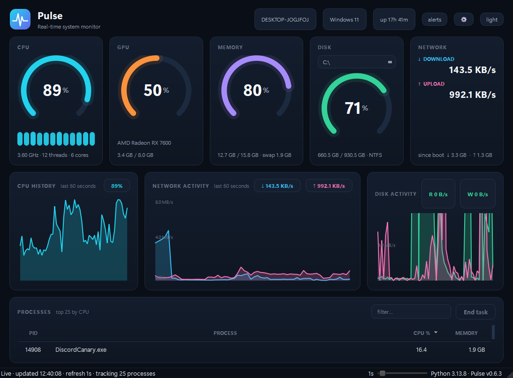

# Pulse

A desktop system monitor written in Python (PySide6 + psutil).

I wanted a Task Manager that doesn't hurt to look at, so I built my own.
Everything on screen — gauges, charts, logo — is drawn in code with QPainter,
no image assets anywhere. Works on Windows, Linux and macOS.

Light theme: [screenshot-light.png](docs/screenshot-light.png)

What's in it:

- live CPU / memory / disk gauges + per-core bars
- GPU card with utilization and VRAM: NVIDIA through NVML, AMD/Intel on
  Windows through the gpu performance counters
- 60-second rolling CPU and network charts
- sortable process table with a filter box and an end-task button
- double-click a process for full details (command line, exe, user,
  priority, affinity, live cpu sparkline); right-click for end process
  tree, priority and affinity controls
- watchlist: pin processes to the top with right-click → Watch
- cpu/ram alerts through the tray, thresholds configurable in settings
- the tray icon is a tiny live cpu graph
- filter box understands `cpu>50`, `mem>100mb`, plain text, and combos
- space freezes updates, ctrl+f jumps to the filter, delete ends the
  selected task, ctrl+shift+c copies the visible rows as csv
- system tray mode: close button hides to the tray, plus a draggable
  always-on-top mini overlay (tray menu → "Mini overlay")
- light/dark theme (dark by default), switchable from the header or the tray menu
- `--json` flag prints one snapshot as JSON and exits, for scripting

## Running it

Python 3.10 or newer:

    pip install -r requirements.txt
    python main.py

A few flags:

| flag | what it does |
| --- | --- |
| `--interval 2` | refresh rate in seconds, 0.5–10 (default: whatever you last set with the slider) |
| `--top 40` | how many processes to list (default: last used, initially 25) |
| `--light` | start in the light theme (dark is the default) |
| `--lite` | minimal mode: no charts or overlay, lowest memory/cpu — good for leaving it open all day |
| `--json` | print one snapshot as JSON and exit (no window) |
| `--log FILE` | append a slim JSON line per snapshot to FILE while running |
| `--no-gpu` | skip GPU detection entirely |
| `--screenshot out.png --wait 65` | run for N seconds, save a PNG of the window and quit — that's how I made the screenshot above |

## How it's put together

    main.py                entry point, CLI args
    monitor/app.py         main window, tray, overlay, theme switching
    monitor/collectors.py  QThread that polls psutil and emits snapshots
    monitor/widgets.py     custom-painted gauges, core bars, overlay, logo
    monitor/charts.py      rolling 60s charts, hand-drawn in QPainter
    monitor/processes.py   the sortable/filterable process table
    monitor/actions.py     kill/priority/affinity, confirmations included
    monitor/detail.py      per-process detail popup
    monitor/theme.py       both palettes + the stylesheet, one place
    monitor/fmt.py         byte/duration formatting helpers

The process scan is the slowest psutil call by far, so the whole poll loop
lives on a worker thread and the UI thread only ever touches already-collected
data. That's why the gauges keep animating smoothly while the table refreshes.
GPU counters get their own separate thread since the query takes a couple of
seconds and would otherwise stall the 1s psutil loop.

## Notes

- Per-process CPU% is divided by core count so 100% = all cores, the same
  convention Task Manager uses. htop people: divide by nothing in
  `collectors.py` if you prefer it raw.
- no pyqtgraph/numpy dependency anymore, the charts are plain QPainter now.
  dropped a big chunk of RAM and a slow import at startup
- psutil needs two samples for CPU%, so the worker primes the counters and
  waits out one full interval before the first sample — otherwise the first
  reading includes the app's own startup burst and spikes for no reason.
- On AMD/Intel (Windows path) GPU utilization is the sum over all engines,
  which runs a bit hot versus Task Manager's number. Good enough for a
  dashboard; proper per-engine numbers need vendor libraries.
- Total VRAM comes from the driver registry key because `AdapterRAM` in WMI
  is a 32-bit int and wraps above 4 GB.
- Network totals are since boot, because that's what the kernel counters give you.

## TODO

- GPU on linux (sysfs/`amdgpu` paths)
- temperature sensors on windows (needs driver-specific libraries)
- package as a standalone exe

MIT — see [LICENSE](LICENSE).

Headless smoke tests, if you want to poke at the code:

    python tests/smoke.py
